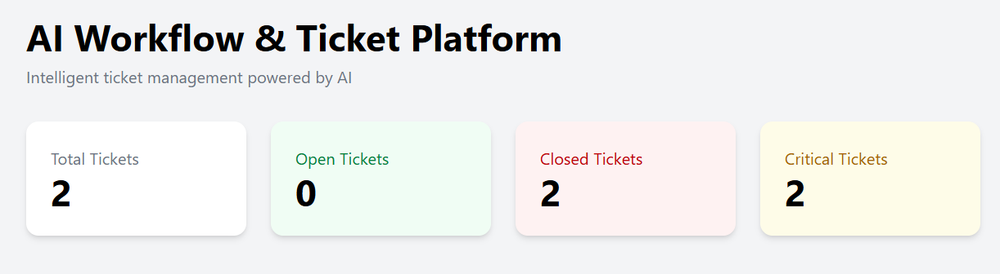
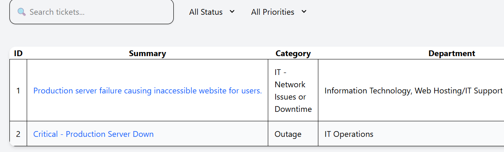

# AI-Powered Workflow & Ticket Management Platform

An AI-powered ticket management and workflow automation system that uses Large Language Models (LLMs) to automatically analyze, categorize, prioritize, and assign support tickets.

The platform combines **FastAPI**, **React**, **Ollama AI**, and workflow automation concepts to create an intelligent support management system.

---

# 🚀 Features

## 🤖 AI Ticket Analysis

Automatically analyzes user issues and generates:

- Ticket summary
- Priority level
- Category classification
- Department assignment
- Team assignment

Supported priorities:

- Critical
- High
- Medium
- Low


## 🎫 Ticket Management

- Create tickets
- View tickets
- Track ticket status
- Close tickets
- Search tickets
- Filter by status
- Filter by priority


## 📊 Analytics Dashboard

Interactive dashboard showing:

- Total tickets
- Open tickets
- Closed tickets
- Priority distribution
- Ticket trends


## ⚡ Workflow Automation

Designed to integrate with automation platforms like:

- n8n
- Webhooks
- Email triggers
- Notification systems


---

# 🏗️ System Architecture


```
                 User
                  |
                  |
            React Dashboard
                  |
                  |
              FastAPI API
                  |
        --------------------
        |                  |
        |                  |
   AI Processing       Database
        |
        |
     Ollama LLM


             |
             |
            n8n
       Automation Layer

```


---

# 🛠️ Tech Stack

## Frontend

- React
- Vite
- Tailwind CSS
- Axios


## Backend

- FastAPI
- Python
- SQLAlchemy
- SQLite/PostgreSQL


## AI

- Ollama
- Large Language Models
- Prompt Engineering


## Automation

- n8n


## Development Tools

- Git
- GitHub
- VS Code


---

# 📂 Project Structure


```
AI-Powered-Workflow-Ticket-Management-Platform

│
├── backend
│   ├── app
│   │   ├── models
│   │   ├── routes
│   │   ├── services
│   │   └── database
│   │
│   ├── requirements.txt
│   └── main.py
│
│
├── frontend
│   ├── src
│   ├── components
│   ├── services
│   └── package.json
│
│
└── README.md

```


---

# ⚙️ Installation & Setup

## Clone Repository


```bash
git clone https://github.com/Sukesh1953/ai-powered-workflow-ticket-management-platform.git

cd ai-powered-workflow-ticket-management-platform
```


---

# Backend Setup


Navigate:

```bash
cd backend
```


Create virtual environment:

```bash
python -m venv venv
```


Activate:

Windows:

```bash
venv\Scripts\activate
```


Install dependencies:

```bash
pip install -r requirements.txt
```


Create `.env` file:

```
OPENROUTER_API_KEY=your_api_key
JWT_SECRET_KEY=your_secret
```


Run backend:

```bash
uvicorn main:app --reload
```


Backend runs on:

```
http://127.0.0.1:8000
```


---

# Frontend Setup


Navigate:

```bash
cd frontend
```


Install packages:

```bash
npm install
```


Run:

```bash
npm run dev
```


Frontend runs on:

```
http://localhost:5173
```


---

# 🔄 Current Workflow


```
User creates ticket

        ↓

FastAPI receives request

        ↓

AI analyzes ticket

        ↓

Ticket classified

        ↓

Stored in database

        ↓

Dashboard displays information

```


---

# 🔮 Future Improvements

Planned features:

- AI-generated resolution suggestions
- Email-to-ticket automation
- n8n workflow integration
- Telegram/Slack notifications
- Role-based authentication
- PostgreSQL deployment
- Cloud deployment
- Advanced analytics
- AI support agent


---

# 📸 Screenshots

## Dashboard




## Ticket Details




## Analytics


---

# 👨‍💻 Author

**Sukesh Padagatti**

AI / Data Science Enthusiast

Interested in:
- Artificial Intelligence
- Machine Learning
- Automation
- Agentic AI Systems


---

# ⭐ Project Status

🚧 Active Development
